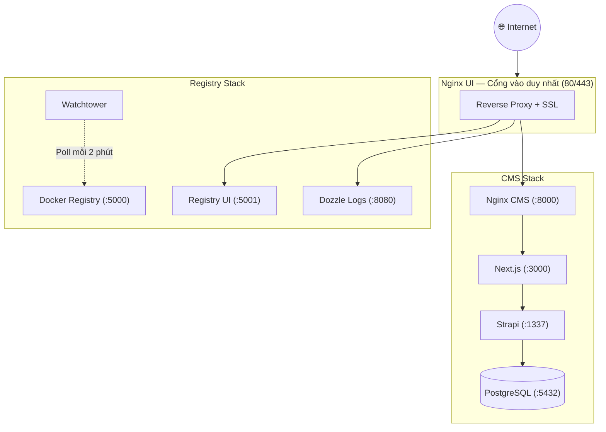
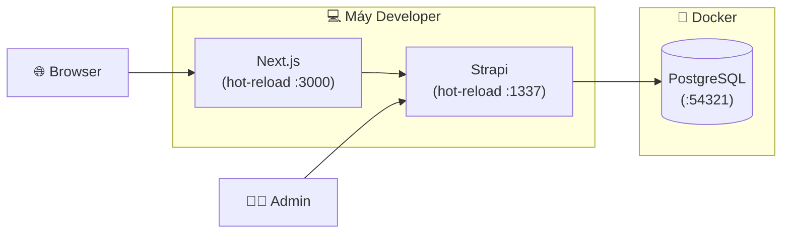
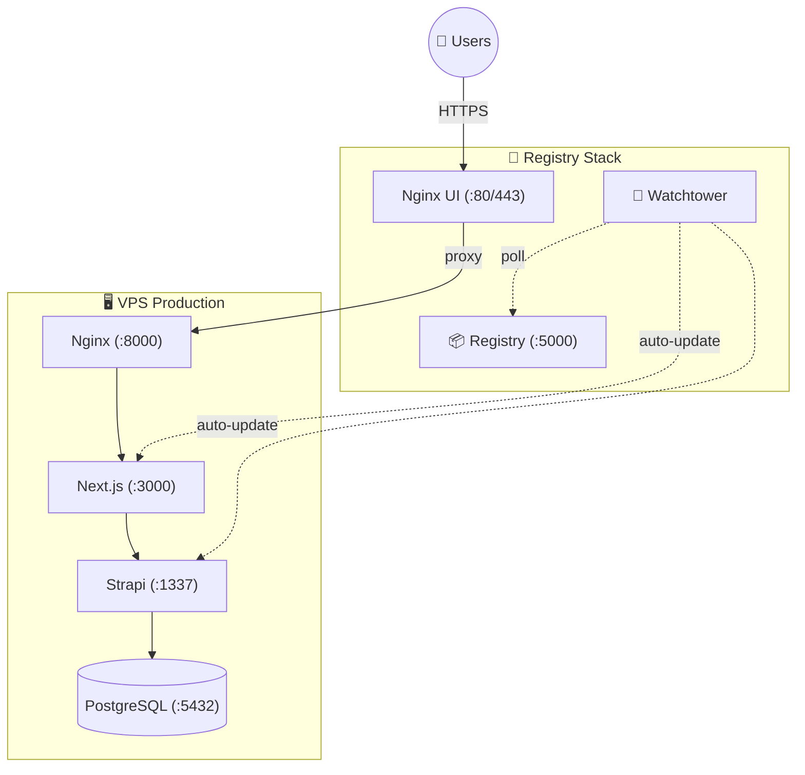
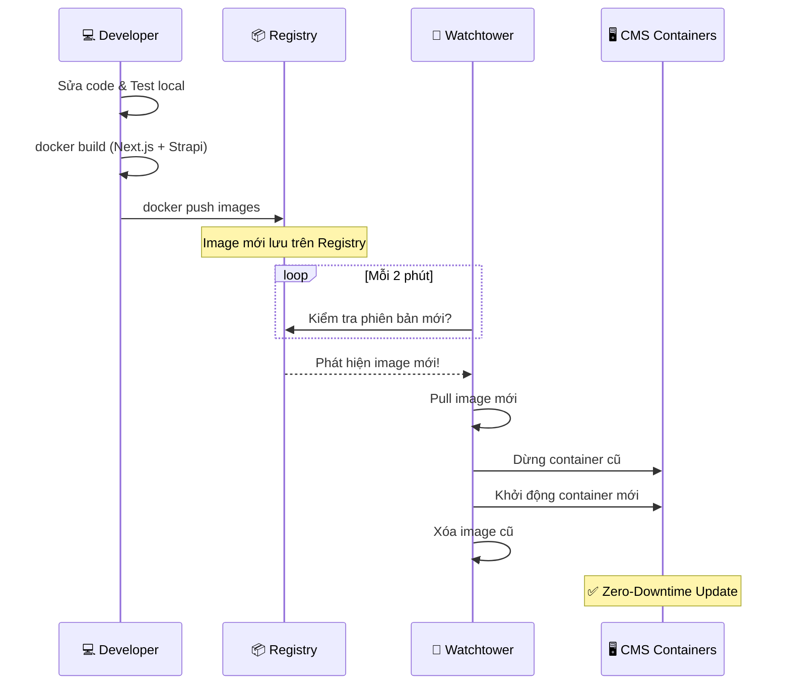
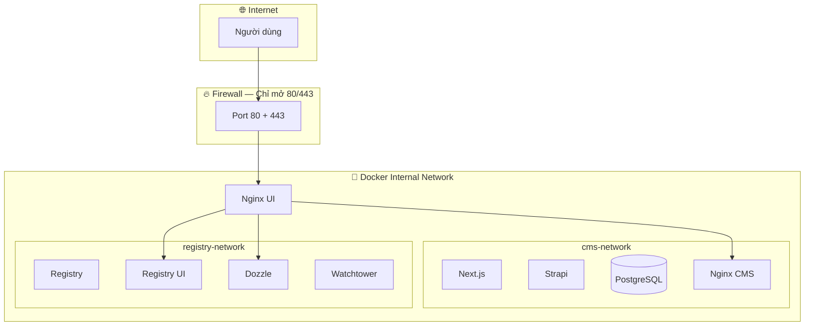

# 🏗️ Kiến Trúc Hệ Thống

Trang này cung cấp cái nhìn tổng quan về toàn bộ hệ sinh thái **LaunchPad** — giúp bạn hiểu cách các thành phần kết nối và hoạt động cùng nhau.

## Hệ Sinh Thái LaunchPad

LaunchPad gồm **2 stack** hoạt động phối hợp:

| Stack | Repository | Vai trò |
| :---- | :--------- | :------ |
| **CMS Stack** | `launchpad-cms-fullstack` | Strapi 5 + Next.js + PostgreSQL + Nginx — ứng dụng web chính |
| **Registry Stack** | `launchpad-registry-stack` | Docker Registry + Nginx UI + Dozzle + Watchtower — hạ tầng DevOps |

::: tip Mối quan hệ giữa 2 Stack
**CMS Stack** chứa source code và ứng dụng. **Registry Stack** là hạ tầng giúp triển khai và vận hành CMS Stack trên VPS. Cả hai đều chạy trên cùng một VPS.
:::

---

## 🌐 Tổng Quan Kiến Trúc Production

::: info Giải thích
- **Nginx UI** là điểm duy nhất tiếp nhận traffic từ internet (port 80/443)
- Tất cả dịch vụ khác chỉ expose trong mạng Docker nội bộ
- **Watchtower** tự động kiểm tra image mới từ Registry mỗi 2 phút
:::

---

## 💻 Kiến Trúc Development (Máy Local)

Khi phát triển trên máy cá nhân, chỉ Database chạy trong Docker:

::: tip Hot-Reload
Cả Next.js và Strapi đều chạy trực tiếp trên máy bạn với **hot-reload** — mỗi khi lưu file, trình duyệt tự động cập nhật.
:::

---

## 🚀 Kiến Trúc Production (VPS)

Trên VPS, tất cả dịch vụ chạy trong Docker containers. VPS **không build code** — chỉ pull image đã build sẵn:

---

## 🔄 Luồng CI/CD — Zero-Downtime Deployment

::: info Không cần SSH
Sau khi push image lên Registry, bạn **không cần SSH** vào VPS. Watchtower tự động phát hiện và cập nhật trong vòng 2 phút.
:::

---

## 📊 Bảng Port Mapping

### Development (Máy Local)

| Dịch vụ | Port | URL | Mô tả |
| :------ | :--- | :-- | :---- |
| Next.js | `3000` | http://localhost:3000 | Website Frontend |
| Strapi | `1337` | http://localhost:1337/admin | CMS Admin Panel |
| PostgreSQL | `54321` | — | Database |
| Nginx | `8080` | http://localhost:8080 | Reverse Proxy |
| Adminer | `8080` | http://localhost:8080 | Database GUI |

### Production (VPS)

| Dịch vụ | Port | Expose | Mô tả |
| :------ | :--- | :----- | :---- |
| Next.js | `3000` | Nội bộ Docker | Website Frontend |
| Strapi | `1337` | Nội bộ Docker | CMS API |
| PostgreSQL | `5432` | Nội bộ Docker | Database |
| Nginx CMS | `8000` | Nội bộ Docker | Proxy cho Next.js + Strapi |
| Registry | `5000` | `5000` | Docker Registry API |
| Registry UI | `5001` | `5001` | Registry Web UI |
| Nginx UI | `80/443` | **Internet** | SSL + Reverse Proxy |
| Dozzle | `8080` | `127.0.0.1` only | Log Viewer |
| Cockpit | `9090` | `9090` | Server Admin |

::: warning Chỉ port 80/443 mở ra Internet
Tất cả dịch vụ khác chỉ truy cập được qua mạng Docker nội bộ hoặc localhost. Nginx UI là **gateway duy nhất** tiếp nhận traffic từ internet.
:::

---

## 🌐 Bảng Subdomain (Ví dụ)

::: info Chưa có domain?
Bạn hoàn toàn có thể chạy hệ thống chỉ với IP. Xem hướng dẫn tại [Triển khai lên VPS → Chạy Không Có Domain](./deploy#chạy-không-có-domain-dùng-ip).
:::

| Subdomain | Dịch vụ | Cổng nội bộ | Ghi chú |
| :-------- | :------ | :---------- | :------ |
| `nhaateliertattoo.com` | Website (Next.js) | `8000` | Trang chính |
| `admin.nhaateliertattoo.com` | Strapi Admin | `1337` | Quản trị nội dung |
| `nginx-ui.nhaateliertattoo.com` | Nginx UI | `9000` | Quản lý Nginx + SSL |
| `dozzle.nhaateliertattoo.com` | Dozzle Logs | `8080` | Xem log (Basic Auth) |
| `registry-ui.nhaateliertattoo.com` | Registry UI | `5001` | Quản lý Docker images |
| `cockpit.nhaateliertattoo.com` | Cockpit | `9090` | Quản lý server |

---

## 🔒 Mạng Docker (Network Topology)

::: tip Bảo mật theo thiết kế
Database, Strapi API, và Registry đều **ẩn hoàn toàn** trong mạng Docker nội bộ. Không thể truy cập trực tiếp từ internet — mọi request đều phải đi qua Nginx UI.
:::

---

## Bước Tiếp Theo

👉 **Tôi muốn bắt đầu phát triển** → [Local Development](./local-dev)

👉 **Tôi muốn triển khai lên VPS** → [Triển khai lên VPS](./deploy)

👉 **Tôi muốn hiểu hạ tầng Registry** → [Hạ Tầng Registry Stack](./registry-stack)

