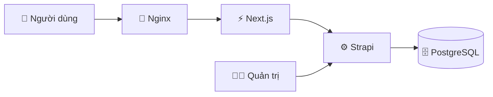
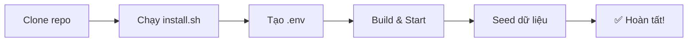

# Giới Thiệu & Cài Đặt

Chào mừng bạn đến với **LaunchPad CMS Fullstack**! Trang này sẽ giúp bạn hiểu hệ thống là gì và chạy nó trên máy tính của mình trong vài phút.

## LaunchPad là gì?

LaunchPad là một bộ giải pháp **Headless CMS** sẵn sàng cho Production, bao gồm hai phần hoạt động cùng nhau:

| Phần              | Công nghệ  | Vai trò                        |
| :---------------- | :--------- | :----------------------------- |
| **Backend (CMS)** | Strapi 5   | Quản lý nội dung, cung cấp API |
| **Frontend**      | Next.js 15 | Hiển thị website, tối ưu SEO   |
| **Database**      | PostgreSQL | Lưu trữ dữ liệu                |
| **Proxy**         | Nginx      | Điều phối traffic ra internet  |



Tất cả được đóng gói bằng **Docker Compose** — bạn không cần cài Node.js, PostgreSQL hay bất cứ thứ gì khác ngoài Docker.

## Yêu Cầu Hệ Thống

Trước khi bắt đầu, hãy đảm bảo máy tính của bạn đã có:

::: info Bắt buộc

- **Docker Desktop** — [Tải về tại đây](https://www.docker.com/products/docker-desktop/) _(Windows / macOS / Linux)_
- **Git** — để clone mã nguồn về máy
  :::

::: tip Khuyên dùng (cho Developer)

- **Node.js 20+** và **Yarn** — nếu bạn muốn phát triển / chỉnh sửa code
- **VS Code** — editor được tối ưu sẵn với `.vscode/tasks.json`
  :::

---

## Cài Đặt Nhanh



### Bước 1 — Clone dự án

```bash
git clone https://github.com/tuquet/launchpad-cms-fullstack.git
cd launchpad-cms-fullstack
```

### Bước 2 — Chạy 1 lệnh duy nhất

```bash
bash scripts/install.sh
```

Script này sẽ tự động làm tất cả:

1. ✅ Kiểm tra Docker đang chạy
2. ✅ Tạo file `.env` với cấu hình mặc định
3. ✅ Build và khởi động toàn bộ hệ thống
4. ✅ Nạp dữ liệu mẫu (demo data)

::: details Cài đặt thủ công từng bước (cho Developer)
**1. Tạo file cấu hình:**

```bash
bash scripts/copy-env.sh --env dev
```

**2. Khởi động hệ thống:**

```bash
docker compose up -d --build
```

**3. Nạp dữ liệu mẫu:**

```bash
docker compose exec strapi sh -c 'echo "y" | yarn strapi import -f ./data/export_20250116105447.tar.gz --force'
```

:::

---

## Truy Cập Hệ Thống

Sau khi cài đặt xong (thường mất 2–5 phút lần đầu), mở trình duyệt và truy cập:

| Dịch vụ             | URL                                                                                      | Mô tả                      |
| :------------------ | :--------------------------------------------------------------------------------------- | :------------------------- |
| 🌐 **Website**      | [http://localhost:3000](http://localhost:3000)                                           | Giao diện người dùng cuối  |
| 🛠️ **Strapi Admin** | [http://localhost:1337/admin](http://localhost:1337/admin)                               | Quản trị nội dung CMS      |
| 🗄️ **Adminer (DB)** | [http://localhost:8080](http://localhost:8080)                                           | Xem / sửa dữ liệu database |
| 📖 **API Docs**     | [http://localhost:1337/documentation/v1.0.0](http://localhost:1337/documentation/v1.0.0) | Swagger API Reference      |

::: tip Tài khoản Strapi Admin
Lần đầu truy cập `/admin`, Strapi sẽ yêu cầu bạn tạo tài khoản admin. Điền email và mật khẩu bất kỳ — tài khoản này chỉ dùng cho môi trường local của bạn.
:::

---

## Cấu Trúc Thư Mục

```
launchpad-cms-fullstack/
├── next/              # 🎨 Frontend — Next.js
├── strapi/            # ⚙️  Backend — Strapi CMS
├── nginx/             # 🔀 Reverse Proxy config
├── scripts/           # 🛠️  Shell scripts tiện ích
├── docs/              # 📖 Tài liệu này (VitePress)
├── compose.yml        # 🐳 Docker Compose (development)
├── compose.prod.yml   # 🐳 Docker Compose (production)
└── .env.example       # 📋 Mẫu biến môi trường
```

---

## Bước Tiếp Theo

Sau khi hệ thống chạy thành công, bạn muốn làm gì?

<div class="tip custom-block" style="padding-top: 8px">

👉 **Tôi muốn chỉnh sửa code và phát triển** → [Local Development](./local-dev)

👉 **Tôi muốn nạp nội dung thật bằng AI** → [Seed Nội Dung](./content-seeding)

👉 **Tôi muốn đưa lên server thật (VPS)** → [Triển khai lên VPS](./deploy)

</div>
