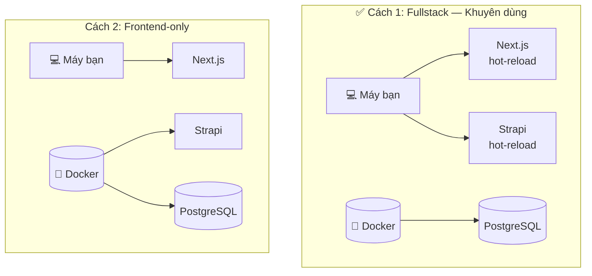

# Local Development

Hướng dẫn này dành cho **Developer** muốn chỉnh sửa code và phát triển tính năng mới trên máy cá nhân.

## TL;DR — Chạy ngay trong 3 lệnh

Nếu bạn đã có Docker và Yarn, chỉ cần:

```bash
# 1. Khởi động Database
docker compose up -d launchpad-db

# 2. Cài thư viện & cấu hình môi trường
yarn setup

# 3. Chạy dev server (Next.js + Strapi cùng lúc)
yarn dev
```

Truy cập: **Strapi** → http://localhost:1337/admin | **Next.js** → http://localhost:3000

---

## Hai Cách Phát Triển

Tùy vào công việc của bạn, hãy chọn mô hình phù hợp:



---

## Cách 1: Fullstack Development _(Khuyên dùng)_

Chỉ Database chạy trong Docker. Next.js và Strapi đều chạy thẳng trên máy bạn với **hot-reload** đầy đủ.

### Khi nào dùng?

- Bạn cần chỉnh sửa cả Frontend lẫn Backend
- Bạn muốn tốc độ reload nhanh nhất

### Các bước

**Bước 1:** Khởi động Database

```bash
docker compose up -d launchpad-db
```

**Bước 2:** Cài đặt thư viện _(chỉ cần làm lần đầu hoặc khi có thư viện mới)_

```bash
yarn setup
```

Lệnh này tự động: copy `.env.example` → `.env`, cài `node_modules` cho cả Next.js và Strapi.

**Bước 3:** Chạy cả Next.js và Strapi song song

```bash
yarn dev
```

::: info Cơ chế hoạt động
`yarn dev` dùng `concurrently` để chạy song song hai tiến trình. Strapi khởi động trước tại `:1337`, Next.js tự động **chờ** Strapi sẵn sàng rồi mới khởi động tại `:3000`.
:::

### Cấu hình `.env` cho Cách 1

File `next/.env.local` (tự động tạo bởi `yarn setup`):

```ini
# URL để trình duyệt (Client Components) gọi API
NEXT_PUBLIC_API_URL=http://localhost:1337

# Không cần STRAPI_INTERNAL_URL — hệ thống dùng NEXT_PUBLIC_API_URL làm fallback
```

---

## Cách 2: Frontend-Only Development

Toàn bộ Backend (Strapi + Database) chạy trong Docker. Bạn chỉ cần chạy Next.js trên máy.

### Khi nào dùng?

- Bạn chỉ làm UI/Frontend, không cần đụng đến code Strapi
- Bạn muốn Backend luôn ổn định, không bị ảnh hưởng bởi code mình đang viết

### Các bước

**Bước 1:** Khởi động Backend hoàn chỉnh trong Docker

```bash
docker compose up -d launchpad-db strapi
```

Chờ khoảng 30–60 giây. Kiểm tra bằng cách mở http://localhost:1337/admin.

**Bước 2:** Tạo file `next/.env.local`

```ini
# URL để trình duyệt (Client Components) gọi API
NEXT_PUBLIC_API_URL=http://localhost:1337

# BẮT BUỘC: ghi đè URL nội bộ vì Next.js chạy ngoài Docker
STRAPI_INTERNAL_URL=http://localhost:1337
```

**Bước 3:** Chạy Next.js

```bash
cd next && yarn dev
```

---

## Tại Sao Cần `STRAPI_INTERNAL_URL`? {#strapi-internal-url}

Khi Next.js render trang phía Server (SSR / Server Components), nó gọi API Strapi từ trong **Node.js process** — không phải từ trình duyệt.

::: details Giải thích chi tiết

```
Strapi chạy trong Docker, Next.js chạy trên máy bạn:

  Next.js (server) → "http://strapi:1337"   ❌ Lỗi! Máy bạn không biết "strapi" là gì

  Next.js (server) → "http://localhost:1337" ✅ Hoạt động bình thường
                         ↑
              Thêm STRAPI_INTERNAL_URL=http://localhost:1337
```

Khi cả hai cùng chạy trong Docker (production), DNS nội bộ Docker tự giải quyết — bạn không cần lo.
:::

---

## Xử Lý Lỗi Thường Gặp

### ❌ `ENOTFOUND strapi` hoặc `FetchError` khi tải trang

**Nguyên nhân:** Next.js đang cố gọi `http://strapi:1337` nhưng máy bạn không hiểu địa chỉ này.

**Giải pháp:** Thêm vào `next/.env.local`:

```ini
STRAPI_INTERNAL_URL=http://localhost:1337
```

Restart Next.js: `Ctrl+C` → `yarn dev`.

---

### ❌ `Address already in use` (xung đột cổng)

**Nguyên nhân:** Bạn vừa chạy Strapi trong Docker, vừa chạy `yarn dev` ở thư mục gốc (command đó cũng khởi động Strapi).

**Giải pháp:** Chỉ chọn **một trong hai**:

- `yarn dev` ở **thư mục gốc** → Strapi chạy thẳng trên máy (Cách 1)
- `yarn dev` trong **`next/`** → Strapi chạy Docker (Cách 2)

---

### ❌ Next.js không hiển thị được ảnh từ Strapi

**Nguyên nhân:** Domain Strapi chưa được khai báo trong `next.config.mjs`.

**Kiểm tra:** Mở `next/next.config.mjs`, tìm `images.remotePatterns`. Mặc định đã cho phép `localhost:1337`. Nếu bạn đổi port hoặc dùng domain khác, bổ sung vào đây.

---

## Lệnh Hữu Ích

```bash
# Dọn dẹp .next và dist (khi gặp lỗi build kỳ lạ)
yarn clean

# Dọn dẹp toàn bộ node_modules (reset hoàn toàn)
yarn clean:full && yarn setup

# Chỉ chạy Strapi
yarn strapi

# Chỉ chạy Next.js (Strapi phải đang chạy trước)
yarn next

# Xem log container Docker
docker compose logs -f strapi
docker compose logs -f launchpad-nextjs
```
