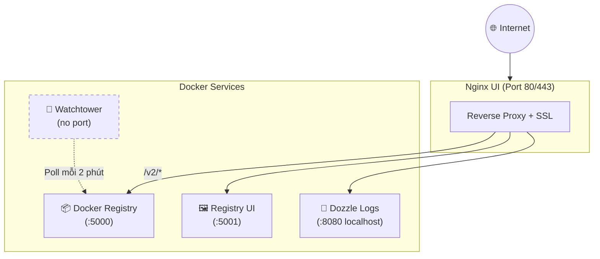
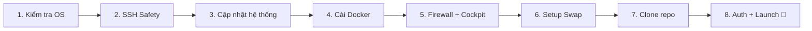
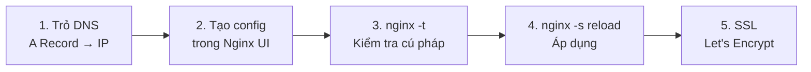
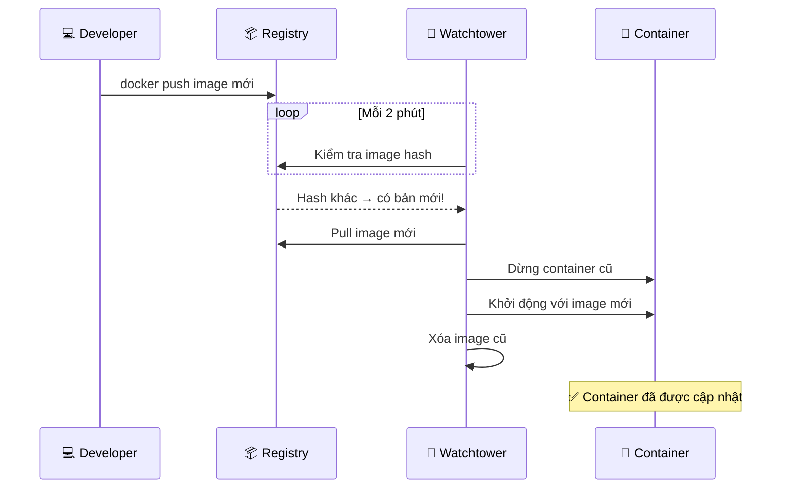

# 🔧 Hạ Tầng Registry Stack

Hướng dẫn cài đặt và vận hành **LaunchPad Registry Stack** — hệ thống Private Docker Registry với giao diện quản trị trực quan, được thiết kế cho VPS cấu hình thấp (< 1GB RAM).

## Registry Stack là gì?

Registry Stack là bộ hạ tầng DevOps bao gồm **5 dịch vụ** hoạt động cùng nhau:

| Dịch vụ | Image | Vai trò |
| :------ | :---- | :------ |
| **Docker Registry** | `registry:2` | Lưu trữ Docker images (private) |
| **Registry UI** | `joxit/docker-registry-ui` | Giao diện web quản lý images |
| **Nginx UI** | `uozi/nginx-ui` | Reverse proxy + SSL + Web admin |
| **Dozzle** | `amir20/dozzle` | Xem log container real-time (~5MB RAM) |
| **Watchtower** | `containrrr/watchtower` | Tự động cập nhật containers |

::: tip Tại sao cần Private Registry?
- **Bảo mật**: Images của bạn không public trên Docker Hub
- **Tốc độ**: VPS pull image từ chính nó (localhost) — siêu nhanh
- **Kiểm soát**: Toàn quyền quản lý phiên bản, xóa image cũ, giới hạn truy cập
:::

---

## 🏗️ Kiến Trúc Dịch Vụ



---

## ⚡ Cài Đặt Nhanh (1 Lệnh)

::: info Yêu cầu
- VPS chạy **Ubuntu/Debian** (apt-get)
- Có quyền **SSH root** hoặc sudo
- Tối thiểu **512MB RAM** (khuyến nghị 1GB)
:::

```bash
git clone https://github.com/tuquet/launchpad-registry-stack.git
cd launchpad-registry-stack
chmod +x install.sh && ./install.sh
```

Script `install.sh` tự động thực hiện **8 bước**:



::: details Chi tiết từng bước
1. **Kiểm tra OS** — Chỉ hỗ trợ Debian/Ubuntu
2. **SSH Safety Guard** — Đảm bảo không khóa port SSH
3. **Cập nhật hệ thống** — `apt-get update` + cài curl, git, htop...
4. **Docker Engine** — Cài qua script chính thức
5. **Firewalld + Cockpit** — Firewall + giao diện quản lý server
6. **Swap Setup** — Tạo 2GB swap cho VPS RAM thấp
7. **Git Clone** — Tải mã nguồn Registry Stack
8. **Auth + Launch** — Tạo user, khởi động toàn bộ stack
:::

Sau khi chạy xong, bạn sẽ thấy:
- **Nginx UI Install Secret** — dùng để đăng nhập lần đầu
- **URL truy cập** — `http://<IP_VPS>` (port 80)

---

## 🔐 Quản Lý Xác Thực

Registry sử dụng **htpasswd với Bcrypt** — không cần cài thêm package nào trên VPS.

```bash
# Thêm user mới
./scripts/manage-auth.sh add <username> <password>

# Xóa user
./scripts/manage-auth.sh delete <username>

# Liệt kê tất cả user
./scripts/manage-auth.sh list
```

::: tip Zero-Dependency
Script sử dụng Docker container `registry:2` để tạo Bcrypt hash — không cần cài `apache2-utils` hay bất kỳ package nào.
:::

---

## 🌐 Cấu Hình Subdomain

::: info Bạn chưa có domain?
Bạn hoàn toàn có thể sử dụng Registry bằng **IP trực tiếp** (ví dụ: `103.x.x.x:5000`). Phần cấu hình subdomain dưới đây là **tùy chọn** để nâng cấp lên môi trường chuyên nghiệp.
:::

### Luồng cấu hình Subdomain



### Registry UI Subdomain

```nginx
server {
    listen 80;
    server_name registry-ui.yourdomain.com;

    location / {
        proxy_pass http://registry-ui:80;
        proxy_set_header Host $host;
        proxy_set_header X-Real-IP $remote_addr;
    }
}
```

### Nginx UI Subdomain (WebSocket)

```nginx
map $http_upgrade $connection_upgrade {
    default upgrade;
    '' close;
}

server {
    listen 80;
    server_name nginx-ui.yourdomain.com;

    location / {
        proxy_pass http://127.0.0.1:9000;
        proxy_set_header Host $host;
        proxy_set_header X-Real-IP $remote_addr;

        # WebSocket cho Web Terminal
        proxy_http_version 1.1;
        proxy_set_header Upgrade $http_upgrade;
        proxy_set_header Connection $connection_upgrade;
    }
}
```

### Dozzle Subdomain (Basic Auth)

```nginx
server {
    listen 80;
    server_name dozzle.yourdomain.com;

    auth_basic "Restricted Access";
    auth_basic_user_file /etc/nginx/registry.password;

    location / {
        proxy_pass http://127.0.0.1:8080;
        proxy_set_header Host $host;
        proxy_set_header X-Real-IP $remote_addr;

        # WebSocket cho live log streaming
        proxy_http_version 1.1;
        proxy_set_header Upgrade $http_upgrade;
        proxy_set_header Connection $connection_upgrade;
    }
}
```

### Cockpit Subdomain

```nginx
server {
    listen 80;
    server_name cockpit.yourdomain.com;

    location / {
        proxy_pass https://127.0.0.1:9090;
        proxy_set_header Host $host;
        proxy_set_header X-Real-IP $remote_addr;

        proxy_ssl_verify off;

        # WebSocket
        proxy_http_version 1.1;
        proxy_set_header Upgrade $http_upgrade;
        proxy_set_header Connection $connection_upgrade;
    }
}
```

::: warning Nhớ cấu hình Cockpit Origins
Thêm vào `/etc/cockpit/cockpit.conf`:
```ini
[WebService]
Origins = https://cockpit.yourdomain.com
```
:::

---

## 🔄 Watchtower — Cập Nhật Tự Động

Watchtower tự động kiểm tra và cập nhật containers mà **không cần SSH vào server**.

### Cấu hình

```yaml
# Trong compose.yml
watchtower:
  image: containrrr/watchtower:latest
  environment:
    - WATCHTOWER_POLL_INTERVAL=120        # Poll mỗi 2 phút
    - WATCHTOWER_LABEL_ENABLE=true        # Chỉ update container có label
    - WATCHTOWER_CLEANUP=true             # Tự xóa image cũ
```

### Cách hoạt động



### Label bắt buộc

Chỉ container có label sau mới được Watchtower cập nhật:

```yaml
labels:
  - "com.centurylinklabs.watchtower.enable=true"
```

::: info Container nào được auto-update?
- ✅ Registry, Registry UI, Nginx UI, Dozzle — **có** (hạ tầng tự cập nhật)
- ✅ Next.js, Strapi (trong CMS Stack) — **có** (code tự cập nhật khi push image mới)
- ❌ PostgreSQL — **không** label (database không nên tự cập nhật)
:::

---

## 🛠️ Vận Hành & Bảo Trì

### Dọn dẹp rác (Garbage Collection)

```bash
./scripts/clean-registry.sh
```

Script thực hiện:
1. **Dry-run** — xem trước sẽ xóa gì
2. **Garbage collection** — xóa layer không còn tham chiếu
3. Gợi ý chạy `docker system prune` cho dọn dẹp sâu hơn

### Backup

```bash
./scripts/backup-registry.sh
```

| Nội dung backup | File |
| :-------------- | :--- |
| Registry data (images) | `backup-registry-YYYYMMDD.tar.gz` |
| Nginx UI config | `backup-nginx-ui-YYYYMMDD.tar.gz` |
| Auth credentials | `backup-auth-YYYYMMDD.tar.gz` |

::: tip Tự động backup hàng ngày
Thêm vào crontab:
```bash
crontab -e
# Chạy backup lúc 3h sáng mỗi ngày, giữ 7 ngày gần nhất
0 3 * * * /home/user/launchpad-registry-stack/scripts/backup-registry.sh
```
:::

### Firewall

Chỉ các port sau được mở ra Internet:

| Port | Dịch vụ | Ghi chú |
| :--- | :------ | :------ |
| `22` | SSH | Quản trị server |
| `80` | HTTP | Nginx UI |
| `443` | HTTPS | Nginx UI (SSL) |

Tất cả port khác (`5000`, `5001`, `8080`, `9090`) chỉ truy cập qua Docker network nội bộ hoặc qua reverse proxy của Nginx UI.

---

## Bước Tiếp Theo

<div class="tip custom-block" style="padding-top: 8px">

👉 **Xem kiến trúc tổng thể** → [Kiến Trúc Hệ Thống](./architecture)

👉 **Triển khai CMS lên VPS** → [Triển khai lên VPS](./deploy)

👉 **Quay lại trang chủ** → [Trang chủ](/)

</div>
