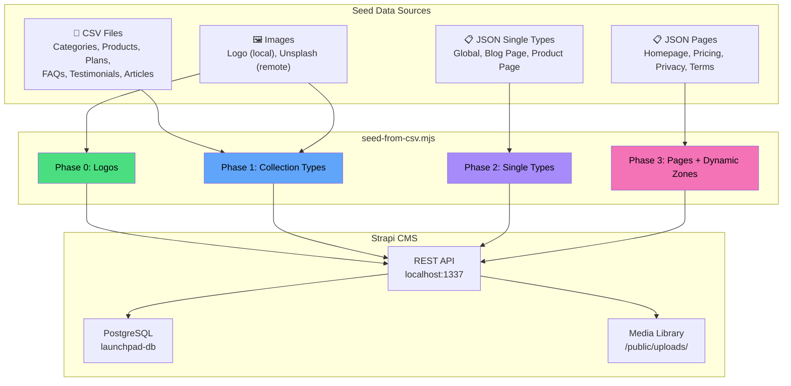
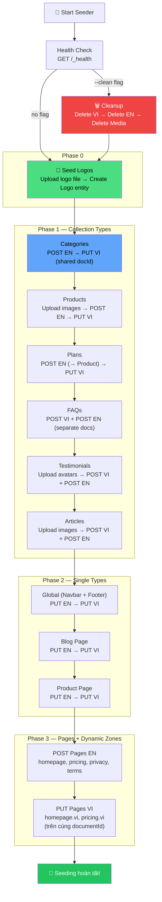
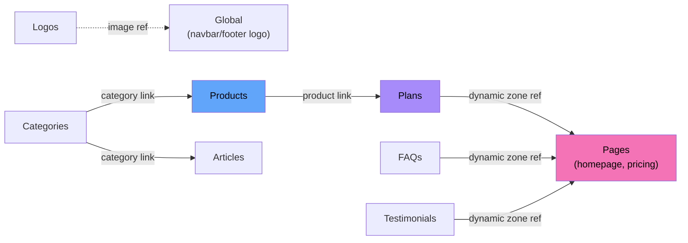
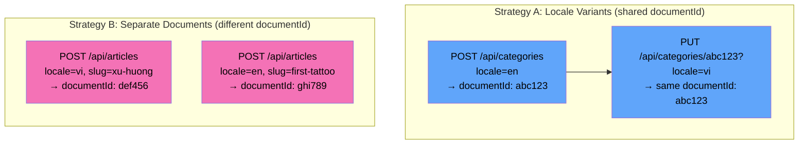
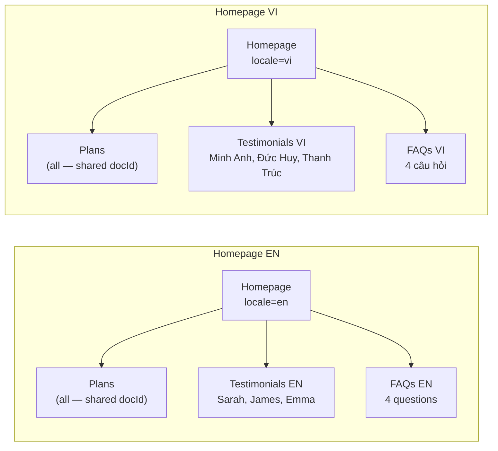
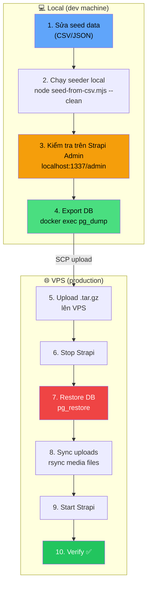

# 🌱 Seed Studio — Nhà Atelier CMS Data Seeder

> **Seed Studio** là công cụ CLI + GUI để nạp dữ liệu mẫu (Content Seeding) vào Strapi CMS.
> Dùng để **khôi phục database** từ đầu hoặc **reset data** trên VPS production.

---

## Mục lục

- [Tổng quan kiến trúc](#tổng-quan-kiến-trúc)
- [Quick Start — Restore DB](#quick-start--restore-db)
- [CLI Commands](#cli-commands)
- [Cấu trúc seed data](#cấu-trúc-seed-data)
- [Pipeline chi tiết](#pipeline-chi-tiết)
- [Strapi v5 Bilingual (i18n)](#strapi-v5-bilingual-i18n)
- [Hướng dẫn chỉnh sửa nội dung](#hướng-dẫn-chỉnh-sửa-nội-dung)
- [Export & Restore lên VPS](#export--restore-lên-vps)
- [Seed Studio GUI](#seed-studio-gui)
- [Troubleshooting](#troubleshooting)

---

## Tổng quan kiến trúc



---

## Quick Start — Restore DB

### Điều kiện tiên quyết

| Thành phần | Yêu cầu |
|---|---|
| **Docker** | Containers `launchpad-db` + `strapi` đang chạy |
| **Node.js** | v18+ (có sẵn `fetch` API) |
| **Strapi Admin Token** | Full-access API Token trong `.env` |

### 3 bước restore DB hoàn chỉnh


**Bước 1 — Truncate tất cả data trong PostgreSQL:**

```bash
docker exec launchpad-db psql -U postgres -d strapi -c "
  TRUNCATE TABLE
    articles, articles_categories_lnk,
    categories, products, plans,
    testimonials, faqs, pages, logos,
    files, files_folder_lnk, upload_folders,
    components_shared_users,
    components_shared_perks,
    components_shared_seos
  RESTART IDENTITY CASCADE;
"
```

**Bước 2 — Xóa sạch thư mục uploads + restart Strapi:**

```bash
docker exec strapi rm -rf /opt/app/public/uploads/*
docker restart strapi
# Đợi ~15 giây để Strapi khởi động lại
```

**Bước 3 — Chạy seeder:**

```bash
cd seed-studio
node seed-from-csv.mjs
```

> 💡 **Tip**: Nếu muốn clean + seed bằng API (không cần SQL), dùng: `node seed-from-csv.mjs --clean`

---

## CLI Commands

| Lệnh | Mô tả |
|---|---|
| `node seed-from-csv.mjs` | Seed data (bỏ qua records đã tồn tại) |
| `node seed-from-csv.mjs --clean` | Xóa data cũ qua API → rồi seed mới |
| `node seed-from-csv.mjs --clean-only` | Chỉ xóa data, không seed |
| `node seed-from-csv.mjs --dry-run` | Preview — log ra nhưng không gọi API |

### Biến môi trường

Đọc từ file `.env` ở thư mục cha (root project):

| Biến | Mặc định | Mô tả |
|---|---|---|
| `STRAPI_URL` | `http://localhost:1337` | Strapi API URL |
| `STRAPI_ADMIN_TOKEN` | — | API Token **(bắt buộc)** |
| `SEED_STATIC_DIR` | `../seed-content/` | Thư mục ảnh static local |

---

## Cấu trúc seed data

```
seed-studio/
├── seed-from-csv.mjs            # 🧠 Core seeder script (~1100 dòng)
├── seed-data/
│   ├── 00_logos.csv              # Logo thương hiệu
│   ├── 01_categories.csv         # Danh mục tattoo styles
│   ├── 02_products.csv           # Dịch vụ (EN + VI)
│   ├── 03_plans.csv              # Bảng giá (EN + VI)
│   ├── 04_faqs.csv               # Câu hỏi thường gặp (EN + VI)
│   ├── 05_testimonials.csv       # Đánh giá khách hàng (EN + VI)
│   ├── 06_articles.csv           # Bài viết blog (EN + VI)
│   ├── logo/
│   │   └── Logo_RGB-01.png       # Logo file local
│   ├── blocks/
│   │   └── articles.json         # Rich content blocks cho articles
│   ├── single-types/
│   │   ├── global.json           # Navbar + Footer (EN)
│   │   ├── global.vi.json        # Navbar + Footer (VI)
│   │   ├── blog-page.json        # Trang Blog (EN)
│   │   ├── blog-page.vi.json     # Trang Blog (VI)
│   │   ├── product-page.json     # Trang Services (EN)
│   │   └── product-page.vi.json  # Trang Services (VI)
│   └── pages/
│       ├── homepage.json         # Trang chủ (EN) — 7 dynamic zones
│       ├── homepage.vi.json      # Trang chủ (VI) — 7 dynamic zones
│       ├── pricing.json          # Bảng giá (EN) — 2 dynamic zones
│       ├── pricing.vi.json       # Bảng giá (VI) — 2 dynamic zones
│       ├── privacy.json          # Chính sách bảo mật (EN only)
│       └── terms.json            # Điều khoản dịch vụ (EN only)
└── server.ts                     # Hono backend cho Seed Studio GUI
```

### Quy ước đặt tên file

| Pattern | Ý nghĩa |
|---|---|
| `XX_entity.csv` | Collection Type — thứ tự `XX` quyết định dependency |
| `entity.json` | Nội dung English (default locale) |
| `entity.vi.json` | Nội dung Vietnamese (locale variant) |

---

## Pipeline chi tiết



### Dependency Map — Thứ tự seed phụ thuộc



> ⚠️ **Quan trọng**: Thứ tự seed **không thể đảo**. Nếu Products chưa có thì Plans sẽ thiếu relation `product`. Nếu Plans chưa có thì Homepage dynamic zone thiếu pricing cards.

---

## Strapi v5 Bilingual (i18n)

### Kiến trúc i18n — 2 chiến lược



### Strategy A — Locale Variants (dùng cho entities cần cross-locale relation)

| Entity | Lý do |
|---|---|
| **Categories** | Products link tới category qua `documentId` — EN/VI phải cùng ID |
| **Products** | Plans link tới product qua `documentId` |
| **Plans** | Pages inject plans vào dynamic zone |
| **Pages** | Homepage EN và VI là cùng 1 page, khác ngôn ngữ |

**Cách hoạt động:**
1. `POST /api/categories` với `locale=en` → tạo document mới, nhận `documentId`
2. `PUT /api/categories/{documentId}?locale=vi` → tạo locale variant, **cùng `documentId`**

### Strategy B — Separate Documents (dùng cho entities có nội dung hoàn toàn khác)

| Entity | Lý do |
|---|---|
| **Articles** | Bài viết VI và EN khác slug, khác nội dung hoàn toàn |
| **FAQs** | Câu hỏi VI và EN khác nhau |
| **Testimonials** | Khách hàng VI và EN khác nhau |

**Cách hoạt động:**
1. `POST /api/articles` với `locale=vi` → tạo document riêng
2. `POST /api/articles` với `locale=en` → tạo document riêng khác

### Dynamic Zone — Locale Filtering

Homepage EN chỉ inject EN testimonials/FAQs, Homepage VI chỉ inject VI:



---

## Hướng dẫn chỉnh sửa nội dung

### Sửa nội dung Collection Types (CSV)

Mở file CSV bằng VS Code hoặc Excel, sửa nội dung, rồi chạy lại seeder.

**Ví dụ — Thêm 1 service mới:**

1. Mở `seed-data/02_products.csv`
2. Thêm 2 dòng (1 EN + 1 VI) cuối file:
   ```csv
   "Micro Realism","micro-realism","Hyper-realistic micro tattoo...",0,false,"Fineline","https://...","..|..",en
   "Micro Realism","micro-realism","Hình xăm siêu thực...",0,false,"Fineline","https://...","..|..",vi
   ```
3. Chạy: `node seed-from-csv.mjs --clean`

### Sửa nội dung Single Types (JSON)

Mỗi Single Type có 2 file:
- `entity.json` → nội dung EN
- `entity.vi.json` → nội dung VI

**Ví dụ — Sửa footer:**

1. Mở `seed-data/single-types/global.json` (EN)
2. Sửa `footer.description`
3. Mở `seed-data/single-types/global.vi.json` (VI)
4. Sửa `footer.description` tương ứng
5. Chạy: `node seed-from-csv.mjs`

### Sửa Homepage / Pricing (Pages)

1. Mở `seed-data/pages/homepage.json` (EN)
2. Sửa dynamic zones (hero, features, etc.)
3. Mở `seed-data/pages/homepage.vi.json` (VI) và sửa tương ứng
4. Chạy: `node seed-from-csv.mjs --clean`

> ⚠️ **Lưu ý**: Pages có dynamic zones chứa `_plans_ref`, `_testimonials_ref`, `_faqs_ref` — đây là placeholder được seeder tự inject. **Không sửa trực tiếp các placeholder này.**

---

## Export & Restore lên VPS

### Quy trình hoàn chỉnh



### Bước 4 — Export DB từ local

```bash
# Export toàn bộ database
docker exec launchpad-db pg_dump -U postgres -d strapi -Fc \
  -f /tmp/strapi_seed_backup.dump

# Copy file ra host
docker cp launchpad-db:/tmp/strapi_seed_backup.dump ./strapi_seed_backup.dump
```

### Bước 5 — Upload lên VPS

```bash
scp strapi_seed_backup.dump tattoo@103.249.201.142:/home/tattoo/
```

### Bước 7 — Restore DB trên VPS

```bash
# SSH vào VPS
ssh tattoo@103.249.201.142

# Stop Strapi
docker stop strapi

# Restore DB (overwrite)
docker exec -i launchpad-db pg_restore -U postgres -d strapi \
  --clean --if-exists --no-owner \
  < /home/tattoo/strapi_seed_backup.dump

# Start lại Strapi
docker start strapi
```

### Bước 8 — Sync Media Files (uploads)

```bash
# Từ local machine — sync thư mục uploads lên VPS
rsync -avz --delete \
  ./strapi/public/uploads/ \
  tattoo@103.249.201.142:/path/to/strapi/public/uploads/
```

---

## Seed Studio GUI

### Tech Stack

| Layer | Technology |
|---|---|
| **Frontend** | Svelte 5 + Vite 8 + Tailwind CSS 4 |
| **Backend** | Hono (TypeScript) + `@hono/node-server` |
| **UI Kit** | shadcn-svelte (bits-ui) |

### Khởi chạy GUI

```bash
# Từ root project
yarn seed:ui
```

Lệnh này chạy song song:
- **Vite dev server** (port 5173) — Svelte frontend với HMR
- **Hono server** (port 4000) — API backend với `--watch`
- Vite proxy `/api` → `http://localhost:4000`

### API Endpoints

| Method | Endpoint | Mô tả |
|---|---|---|
| GET | `/api/seed-stream` | SSE stream — chạy seeder script |
| GET | `/api/restore-stream` | SSE stream — khôi phục backup |
| POST | `/api/seed-article` | Tạo article trong Strapi + append CSV |
| GET | `/api/seed-files` | Liệt kê tất cả seed files |
| GET | `/api/seed-file?path=` | Đọc nội dung 1 seed file |
| POST | `/api/append-csv` | Thêm dòng mới vào CSV file |

### Query Params cho `/api/seed-stream`

| Param | Giá trị | Mô tả |
|---|---|---|
| `clean` | `true` | Xóa sạch rồi seed lại |
| `clean-only` | `true` | Chỉ xóa, không seed |
| `token` | `<token>` | Override STRAPI_ADMIN_TOKEN |

---

## Troubleshooting

### ❌ `STRAPI_ADMIN_TOKEN chưa được cấu hình!`

1. Vào Strapi Admin → Settings → API Tokens
2. Tạo token mới, chọn **Full access**
3. Thêm vào `.env` root project:
   ```env
   STRAPI_ADMIN_TOKEN=your_token_here
   ```

### ❌ `HTTP 400 — Document with id "xxx", locale "en" not found`

Dynamic zone inject sai locale refs. Kiểm tra:
- Testimonials/FAQs map đã filter theo locale chưa
- Plans/Products có dùng `putDoc` cho VI locale không

### ❌ `HTTP 400 — This attribute must be unique`

Slug bị trùng. Chạy `--clean` trước hoặc truncate SQL:
```bash
docker exec launchpad-db psql -U postgres -d strapi \
  -c "TRUNCATE TABLE articles RESTART IDENTITY CASCADE;"
```

### ❌ `HTTP 500 — Internal Server Error` khi upload logo

Upload folders bị hỏng. Fix bằng cách restart Strapi:
```bash
docker restart strapi
# Đợi 15 giây rồi chạy lại seeder
```

### ⚠️ Ảnh upload nằm ở root thay vì folder "API Uploads"

Đây là behavior mặc định khi upload qua API. Ảnh vẫn hoạt động bình thường. Nếu muốn tổ chức lại, dùng Strapi Admin UI để di chuyển.

### Cách debug nhanh — Kiểm tra data trong DB

```bash
# Xem categories
docker exec launchpad-db psql -U postgres -d strapi \
  -c "SELECT id, document_id, name, locale FROM categories WHERE published_at IS NOT NULL;"

# Xem products
docker exec launchpad-db psql -U postgres -d strapi \
  -c "SELECT id, document_id, name, locale FROM products WHERE published_at IS NOT NULL;"

# Xem articles
docker exec launchpad-db psql -U postgres -d strapi \
  -c "SELECT id, document_id, slug, locale FROM articles WHERE published_at IS NOT NULL;"

# Xem pages
docker exec launchpad-db psql -U postgres -d strapi \
  -c "SELECT id, document_id, slug, locale FROM pages WHERE published_at IS NOT NULL;"
```
